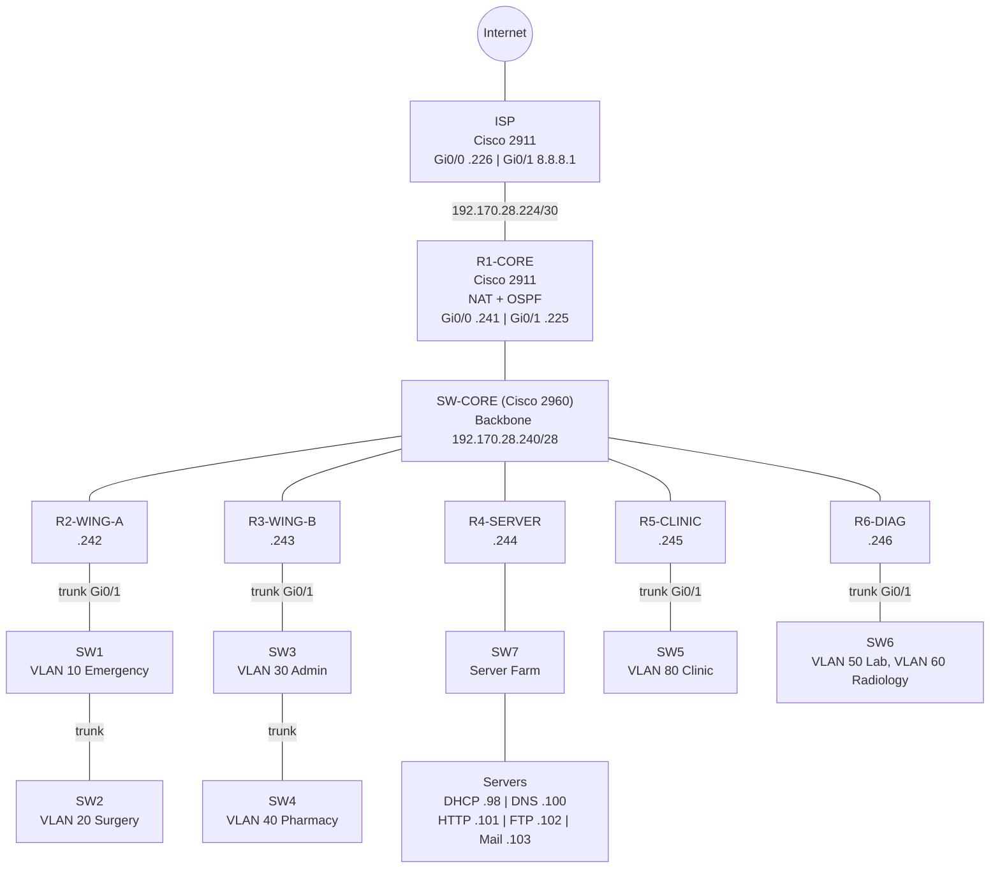

# Hospital & Healthcare Network (Cisco Packet Tracer)

A complete hospital network simulation built in Cisco Packet Tracer. It uses a
collapsed-backbone design with OSPF dynamic routing, seven department VLANs
with router-on-a-stick inter-VLAN routing, distributed DHCP, a centralized
server farm (DNS, HTTP, FTP, email), and NAT/PAT for internet access. The
entire design is subnetted from a single /24 block using VLSM.

## Table of Contents

1. Features
2. Topology
3. Addressing Plan (VLSM)
4. VLAN Design
5. Device Inventory
6. Build Guide (Step by Step)
7. Configuration Reference
8. Verification and Testing
9. Troubleshooting Log
10. Known Limitations and Future Work
11. Repository Layout
12. How to Open the Project
13. License

## 1. Features

- Collapsed backbone: six internal routers and one ISP router, all
  GigabitEthernet, no serial links, joined through one core switch.
- OSPF (single process, Area 0) for fully automatic routing between all
  department networks.
- Seven VLANs: Emergency, Surgery, Admin, Pharmacy, Lab, Radiology, Clinic.
- Router-on-a-stick inter-VLAN routing with dot1Q sub-interfaces. Where one
  router serves two departments, inter-switch trunks extend the second VLAN
  through a daisy-chained switch.
- VLSM addressing: 10 subnets carved from one /24 (four /27, four /28, one /30
  link, one /28 backbone).
- Distributed DHCP: eight pools hosted on five routers, each handing out the
  gateway and DNS server.
- Centralized server farm:
  - DNS (hospital.com zone: www, ftp, mail)
  - HTTP (hospital intranet portal)
  - FTP (authenticated, role-based permissions)
  - Email (SMTP + POP3, domain hospital.com)
  - DHCP server kept as a backup (service off)
- NAT/PAT overload on the edge router, so all internal hosts share one public
  address toward the ISP.
- Baseline security: encrypted privileged password, password encryption,
  console/VTY passwords, VLAN-based department isolation.

## 2. Topology


Mermaid diagram (renders natively on GitHub):



Text overview:

```
                         [ Internet ]
                              |
                        [ ISP router ]  8.8.8.1/24
                              | 192.170.28.224/30
                        [ R1-CORE ]  NAT/PAT + OSPF
                              | Gi0/0  .241
 =========================================================
   SW-CORE (2960)   Backbone 192.170.28.240/28   OSPF Area 0
 =========================================================
    |.242       |.243        |.244        |.245       |.246
 [R2-WING-A] [R3-WING-B] [R4-SERVER]  [R5-CLINIC]  [R6-DIAG]
    | trunk      | trunk      |            | trunk      | trunk
   SW1--SW2     SW3--SW4     SW7          SW5          SW6
   V10  V20     V30  V40   Server farm   V80         V50  V60
   ER   Surg    Adm  Pharm DHCP DNS      Clinic       Lab  Radiology
                           HTTP FTP Mail
```

### Link Summary

| Link | Connection | Purpose |
|---|---|---|
| R1 to R6 Gi0/0 | SW-CORE | Backbone (OSPF Area 0) |
| R1 Gi0/1 | ISP Gi0/0 | Internet uplink (/30) |
| R2 Gi0/1 | SW1 Fa0/1 | Emergency + Surgery trunk |
| R3 Gi0/1 | SW3 Fa0/1 | Admin + Pharmacy trunk |
| R4 Gi0/1 | SW7 Fa0/1 | Server farm |
| R5 Gi0/1 | SW5 Fa0/1 | Clinic trunk |
| R6 Gi0/1 | SW6 Fa0/1 | Lab + Radiology trunk |
| SW1 Fa0/24 | SW2 Fa0/1 | Trunk (carries VLAN 20) |
| SW3 Fa0/24 | SW4 Fa0/1 | Trunk (carries VLAN 40) |

## 3. Addressing Plan (VLSM)

Address block: 192.170.28.0/24

| # | Subnet | Network | CIDR | Mask | Gateway |
|---|---|---|---|---|---|
| 1 | Emergency (VLAN 10) | .0 | /27 | 255.255.255.224 | .1 |
| 2 | Surgery (VLAN 20) | .32 | /27 | 255.255.255.224 | .33 |
| 3 | Admin (VLAN 30) | .64 | /27 | 255.255.255.224 | .65 |
| 4 | Server Farm | .96 | /27 | 255.255.255.224 | .97 |
| 5 | Pharmacy (VLAN 40) | .128 | /28 | 255.255.255.240 | .129 |
| 6 | Lab (VLAN 50) | .144 | /28 | 255.255.255.240 | .145 |
| 7 | Radiology (VLAN 60) | .160 | /28 | 255.255.255.240 | .161 |
| 8 | Clinic (VLAN 80) | .176 | /28 | 255.255.255.240 | .177 |
| 9 | R1-ISP link | .224 | /30 | 255.255.255.252 | n/a |
| 10 | Backbone | .240 | /28 | 255.255.255.240 | n/a |

Backbone addresses: R1 .241, R2 .242, R3 .243, R4 .244, R5 .245, R6 .246
ISP side of the /30: .226 (R1 side: .225)

Static server addresses (mask 255.255.255.224, gateway .97, DNS .100):

| Server | IP | Role |
|---|---|---|
| DHCP-SRV | 192.170.28.98 | DHCP (backup, service off) |
| DNS-SRV | 192.170.28.100 | DNS |
| WEB-SRV | 192.170.28.101 | HTTP |
| FTP-SRV | 192.170.28.102 | FTP |
| MAIL-SRV | 192.170.28.103 | SMTP + POP3 |

## 4. VLAN Design

| VLAN | Name | Switch | Router | Sub-interface | Subnet |
|---|---|---|---|---|---|
| 10 | EMERGENCY | SW1 | R2 | Gi0/1.10 | .0/27 |
| 20 | SURGERY | SW2 (via SW1) | R2 | Gi0/1.20 | .32/27 |
| 30 | ADMIN | SW3 | R3 | Gi0/1.30 | .64/27 |
| 40 | PHARMACY | SW4 (via SW3) | R3 | Gi0/1.40 | .128/28 |
| 50 | LAB | SW6 | R6 | Gi0/1.50 | .144/28 |
| 60 | RADIOLOGY | SW6 | R6 | Gi0/1.60 | .160/28 |
| 80 | CLINIC | SW5 | R5 | Gi0/1.80 | .176/28 |

## 5. Device Inventory

- Routers (7): R1-CORE, R2-WING-A, R3-WING-B, R4-SERVER, R5-CLINIC, R6-DIAG,
  ISP (all Cisco 2911)
- Switches (8): SW-CORE, SW1 to SW7 (all Cisco 2960)
- Servers (5): DHCP-SRV, DNS-SRV, WEB-SRV, FTP-SRV, MAIL-SRV (Server-PT)
- End devices: 12 PCs, two per department area (ER, Surgery, Admin,
  Pharmacy, Clinic, Lab, Radiology)

## 6. Build Guide (Step by Step)

### Step 1: Place devices and cable the backbone
1. Add 7 Cisco 2911 routers, 8 Cisco 2960 switches, 5 servers, and the PCs.
2. Name every device as in the inventory.
3. Connect Gi0/0 of R1 to R6 to SW-CORE ports (copper straight-through).
4. Connect R1 Gi0/1 to ISP Gi0/0 (copper cross-over).
5. Connect each department router's Gi0/1 to its switch's Fa0/1.
6. Add the inter-switch links SW1 Fa0/24 to SW2 Fa0/1 and SW3 Fa0/24 to
   SW4 Fa0/1.
7. Connect PCs to access ports Fa0/2 and up. Connect servers to SW7.

### Step 2: Configure the switches (VLANs and trunks)
Create VLANs, set access ports, and trunk the uplinks. Details in
section 7. Remember the VLAN must exist on every switch it crosses:
VLAN 20 on SW1 and SW2, VLAN 40 on SW3 and SW4.

### Step 3: Configure router interfaces
1. Set the backbone address on each router's Gi0/0 and bring it up.
2. On R2, R3, R5, R6, bring up Gi0/1 with no IP, then create dot1Q
   sub-interfaces with the gateway address for each VLAN.
3. On R4, put the server-farm gateway directly on Gi0/1.
4. On R1, configure the ISP-facing /30. On ISP, configure both interfaces.

### Step 4: Configure OSPF
Enable OSPF process 1 on every router. Advertise the backbone network plus
each router's directly attached LAN subnets, all in Area 0.

### Step 5: Configure DHCP
Exclude the gateway and a few reserved addresses on each router, then create
one pool per VLAN with default-router and dns-server 192.170.28.100.
Pools live on R2 (Emergency, Surgery), R3 (Admin, Pharmacy), R4 (Server
Farm), R5 (Clinic), R6 (Lab, Radiology).

### Step 6: Configure NAT/PAT on R1
Mark Gi0/0 as inside and Gi0/1 as outside, create an ACL permitting
192.170.28.0/24, and enable overload on the Gi0/1 address. Add a default
route toward the ISP.

### Step 7: Configure the servers
Set static IPs, then enable and configure services (section 7.4).

### Step 8: Verify
Run the checks in section 8.

## 7. Configuration Reference

Replace every placeholder in angle brackets with your own value.
Do not publish real passwords.

### 7.1 Routers

R1-CORE (NAT + ISP edge)

```
hostname R1-CORE
enable secret <ENABLE_SECRET>
service password-encryption
interface GigabitEthernet0/0
 ip address 192.170.28.241 255.255.255.240
 ip nat inside
 no shutdown
interface GigabitEthernet0/1
 ip address 192.170.28.225 255.255.255.252
 ip nat outside
 no shutdown
router ospf 1
 network 192.170.28.240 0.0.0.15 area 0
 network 192.170.28.224 0.0.0.3 area 0
ip route 0.0.0.0 0.0.0.0 192.170.28.226
access-list 1 permit 192.170.28.0 0.0.0.255
ip nat inside source list 1 interface GigabitEthernet0/1 overload
```

R2-WING-A (Emergency, Surgery)

```
hostname R2-WING-A
enable secret <ENABLE_SECRET>
interface GigabitEthernet0/0
 ip address 192.170.28.242 255.255.255.240
 no shutdown
interface GigabitEthernet0/1
 no shutdown
interface GigabitEthernet0/1.10
 encapsulation dot1Q 10
 ip address 192.170.28.1 255.255.255.224
interface GigabitEthernet0/1.20
 encapsulation dot1Q 20
 ip address 192.170.28.33 255.255.255.224
ip dhcp excluded-address 192.170.28.1 192.170.28.5
ip dhcp excluded-address 192.170.28.33 192.170.28.37
ip dhcp pool EMERGENCY
 network 192.170.28.0 255.255.255.224
 default-router 192.170.28.1
 dns-server 192.170.28.100
ip dhcp pool SURGERY
 network 192.170.28.32 255.255.255.224
 default-router 192.170.28.33
 dns-server 192.170.28.100
router ospf 1
 network 192.170.28.240 0.0.0.15 area 0
 network 192.170.28.0 0.0.0.31 area 0
 network 192.170.28.32 0.0.0.31 area 0
```

R3-WING-B (Admin, Pharmacy)

```
hostname R3-WING-B
enable secret <ENABLE_SECRET>
interface GigabitEthernet0/0
 ip address 192.170.28.243 255.255.255.240
 no shutdown
interface GigabitEthernet0/1
 no shutdown
interface GigabitEthernet0/1.30
 encapsulation dot1Q 30
 ip address 192.170.28.65 255.255.255.224
interface GigabitEthernet0/1.40
 encapsulation dot1Q 40
 ip address 192.170.28.129 255.255.255.240
ip dhcp excluded-address 192.170.28.65 192.170.28.69
ip dhcp excluded-address 192.170.28.129 192.170.28.132
ip dhcp pool ADMIN
 network 192.170.28.64 255.255.255.224
 default-router 192.170.28.65
 dns-server 192.170.28.100
ip dhcp pool PHARMACY
 network 192.170.28.128 255.255.255.240
 default-router 192.170.28.129
 dns-server 192.170.28.100
router ospf 1
 network 192.170.28.240 0.0.0.15 area 0
 network 192.170.28.64 0.0.0.31 area 0
 network 192.170.28.128 0.0.0.15 area 0
```

R4-SERVER (Server farm)

```
hostname R4-SERVER
enable secret <ENABLE_SECRET>
interface GigabitEthernet0/0
 ip address 192.170.28.244 255.255.255.240
 no shutdown
interface GigabitEthernet0/1
 ip address 192.170.28.97 255.255.255.224
 no shutdown
ip dhcp excluded-address 192.170.28.97 192.170.28.110
ip dhcp pool SERVER-FARM
 network 192.170.28.96 255.255.255.224
 default-router 192.170.28.97
 dns-server 192.170.28.100
router ospf 1
 network 192.170.28.240 0.0.0.15 area 0
 network 192.170.28.96 0.0.0.31 area 0
```

R5-CLINIC

```
hostname R5-CLINIC
enable secret <ENABLE_SECRET>
interface GigabitEthernet0/0
 ip address 192.170.28.245 255.255.255.240
 no shutdown
interface GigabitEthernet0/1
 no shutdown
interface GigabitEthernet0/1.80
 encapsulation dot1Q 80
 ip address 192.170.28.177 255.255.255.240
ip dhcp excluded-address 192.170.28.177 192.170.28.180
ip dhcp pool CLINIC
 network 192.170.28.176 255.255.255.240
 default-router 192.170.28.177
 dns-server 192.170.28.100
router ospf 1
 network 192.170.28.240 0.0.0.15 area 0
 network 192.170.28.176 0.0.0.15 area 0
```

R6-DIAG (Lab, Radiology)

```
hostname R6-DIAG
enable secret <ENABLE_SECRET>
interface GigabitEthernet0/0
 ip address 192.170.28.246 255.255.255.240
 no shutdown
interface GigabitEthernet0/1
 no shutdown
interface GigabitEthernet0/1.50
 encapsulation dot1Q 50
 ip address 192.170.28.145 255.255.255.240
interface GigabitEthernet0/1.60
 encapsulation dot1Q 60
 ip address 192.170.28.161 255.255.255.240
ip dhcp excluded-address 192.170.28.145 192.170.28.148
ip dhcp excluded-address 192.170.28.161 192.170.28.164
ip dhcp pool LAB
 network 192.170.28.144 255.255.255.240
 default-router 192.170.28.145
 dns-server 192.170.28.100
ip dhcp pool RADIOLOGY
 network 192.170.28.160 255.255.255.240
 default-router 192.170.28.161
 dns-server 192.170.28.100
router ospf 1
 network 192.170.28.240 0.0.0.15 area 0
 network 192.170.28.144 0.0.0.15 area 0
 network 192.170.28.160 0.0.0.15 area 0
```

ISP

```
hostname ISP
interface GigabitEthernet0/0
 ip address 192.170.28.226 255.255.255.252
 no shutdown
interface GigabitEthernet0/1
 ip address 8.8.8.1 255.255.255.0
 no shutdown
router ospf 1
 network 192.170.28.224 0.0.0.3 area 0
```

Management access (apply to all routers):

```
service password-encryption
line console 0
 password <CONSOLE_PASSWORD>
 login
line vty 0 4
 password <VTY_PASSWORD>
 login
```

### 7.2 Switches

SW-CORE: default configuration (all ports in VLAN 1).
SW7: default configuration (servers use static IPs).

SW1 (Emergency + trunk to SW2)

```
vlan 10
 name EMERGENCY
vlan 20
 name SURGERY
interface range FastEthernet0/2 - 5
 switchport mode access
 switchport access vlan 10
interface FastEthernet0/24
 switchport mode trunk
interface FastEthernet0/1
 switchport mode trunk
```

SW2 (Surgery)

```
vlan 20
 name SURGERY
interface range FastEthernet0/2 - 3
 switchport mode access
 switchport access vlan 20
interface FastEthernet0/1
 switchport mode trunk
```

SW3 (Admin + trunk to SW4)

```
vlan 30
 name ADMIN
vlan 40
 name PHARMACY
interface range FastEthernet0/2 - 5
 switchport mode access
 switchport access vlan 30
interface FastEthernet0/24
 switchport mode trunk
interface FastEthernet0/1
 switchport mode trunk
```

SW4 (Pharmacy)

```
vlan 40
 name PHARMACY
interface range FastEthernet0/2 - 3
 switchport mode access
 switchport access vlan 40
interface FastEthernet0/1
 switchport mode trunk
```

SW5 (Clinic)

```
vlan 80
 name CLINIC
interface range FastEthernet0/2 - 3
 switchport mode access
 switchport access vlan 80
interface FastEthernet0/1
 switchport mode trunk
```

SW6 (Lab + Radiology)

```
vlan 50
 name LAB
vlan 60
 name RADIOLOGY
interface range FastEthernet0/2 - 3
 switchport mode access
 switchport access vlan 50
interface range FastEthernet0/4 - 24
 switchport mode access
 switchport access vlan 60
interface FastEthernet0/1
 switchport mode trunk
```

### 7.3 DHCP summary

| Pool | Router | Network | Gateway | DNS |
|---|---|---|---|---|
| EMERGENCY | R2 | .0/27 | .1 | .100 |
| SURGERY | R2 | .32/27 | .33 | .100 |
| ADMIN | R3 | .64/27 | .65 | .100 |
| PHARMACY | R3 | .128/28 | .129 | .100 |
| SERVER-FARM | R4 | .96/27 | .97 | .100 |
| CLINIC | R5 | .176/28 | .177 | .100 |
| LAB | R6 | .144/28 | .145 | .100 |
| RADIOLOGY | R6 | .160/28 | .161 | .100 |

### 7.4 Servers

| Server | IP | Service | Configuration |
|---|---|---|---|
| DHCP-SRV | .98 | DHCP | Service off (backup only) |
| DNS-SRV | .100 | DNS | www = .101, ftp = .102, mail = .103 |
| WEB-SRV | .101 | HTTP | Hospital intranet page |
| FTP-SRV | .102 | FTP | One full-access user, one read-only user |
| MAIL-SRV | .103 | SMTP + POP3 | Domain hospital.com, three mailboxes |

Use your own credentials for the FTP and mail accounts. Suggested accounts:
an administrator (full FTP access), a doctor (read-only FTP), and mailboxes
for a doctor, an administrator, and a nurse.

## 8. Verification and Testing

| Test | How | Expected result |
|---|---|---|
| OSPF convergence | `show ip route` on R1 | Department subnets appear as O routes |
| OSPF neighbors | `show ip ospf neighbor` | Five neighbors on the backbone |
| VLANs | `show vlan brief` on each switch | Ports in the correct VLANs |
| Trunks | `show interfaces trunk` | Uplinks trunking, correct allowed VLANs |
| DHCP | Set a PC to DHCP, or `ipconfig /renew` | Address, gateway, DNS received |
| DNS | `nslookup www.hospital.com` | Returns 192.170.28.101 |
| HTTP | Browse to http://www.hospital.com | Intranet portal loads |
| FTP | `ftp 192.170.28.102`, log in, `dir` | Login succeeds, listing returned |
| Email | Send mail between two clients using server IP 192.170.28.103 | Delivered and received |
| NAT | Ping 8.8.8.1 from a PC, then `show ip nat translations` on R1 | Replies, translations listed |
| Inter-VLAN | Ping across two departments | Replies |

## 9. Troubleshooting Log

| Problem | Fix |
|---|---|
| No serial (HWIC-2T) modules available | Switched to a backbone-switch design, all Gigabit |
| Routers serving two departments on one port | Router-on-a-stick plus inter-switch trunks |
| Radiology DHCP failed | Moved sub-interfaces from Gi0/0 to Gi0/1 |
| Daisy-chained switch PCs got no DHCP | Added the VLAN to the upstream switch's database |
| Radiology PCs in wrong VLAN | Assigned Fa0/4 to Fa0/24 to VLAN 60 |
| DNS not resolving on clients | Added dns-server to every DHCP pool |
| DHCP server IP clashed with DNS | Moved DHCP-SRV to .98, kept DNS at .100 |
| NAT not translating | Corrected ip nat inside/outside on R1 |
| OSPF neighbors not forming | Verified the backbone network statement on all routers |
| Email client could not reach server | Used the server IP instead of the domain name |

## 10. Known Limitations and Future Work

- Internet reachability for non-R1 routers: R1 holds a static default route
  but does not advertise it into OSPF. For internal PCs to reach the ISP,
  add `default-information originate` under `router ospf 1` on R1.
- No access control lists between VLANs. Departments are separated by VLAN
  but fully routable to each other.
- SW-CORE is a single point of failure.
- Management uses console/VTY passwords over Telnet.

Planned improvements: ACLs for inter-department filtering, a redundant
backbone switch, SSH management, port security, and a syslog server.

## 11. Repository Layout

```
.
├── README.md
├── LICENSE
├── .gitignore
├── .gitattributes
├── Hospital_Management_System.pkt
└── docs/
    └── screenshots/
        ├── topology.png
        ├── routing-table.png
        ├── dns-nslookup.png
        ├── ftp-login.png
        ├── web-portal.png
        ├── email-test.png
        └── vlan-brief.png
```

## 12. How to Open the Project

1. Install Cisco Packet Tracer (free with a Cisco Networking Academy account).
2. Clone the repository:
```
   git clone https://github.com/<your-username>/<repo-name>.git
```
3. Open `Hospital_Management_System.pkt` in Packet Tracer.
4. Wait for OSPF to converge (about a minute), then run the tests in
   section 8.

## 13. License

MIT. See LICENSE.# Hospital & Healthcare Network (Cisco Packet Tracer)

A complete hospital network simulation built in Cisco Packet Tracer. It uses a
collapsed-backbone design with OSPF dynamic routing, seven department VLANs
with router-on-a-stick inter-VLAN routing, distributed DHCP, a centralized
server farm (DNS, HTTP, FTP, email), and NAT/PAT for internet access. The
entire design is subnetted from a single /24 block using VLSM.

## Table of Contents

1. Features
2. Topology
3. Addressing Plan (VLSM)
4. VLAN Design
5. Device Inventory
6. Build Guide (Step by Step)
7. Configuration Reference
8. Verification and Testing
9. Troubleshooting Log
10. Known Limitations and Future Work
11. Repository Layout
12. How to Open the Project
13. License

## 1. Features

- Collapsed backbone: six internal routers and one ISP router, all
  GigabitEthernet, no serial links, joined through one core switch.
- OSPF (single process, Area 0) for fully automatic routing between all
  department networks.
- Seven VLANs: Emergency, Surgery, Admin, Pharmacy, Lab, Radiology, Clinic.
- Router-on-a-stick inter-VLAN routing with dot1Q sub-interfaces. Where one
  router serves two departments, inter-switch trunks extend the second VLAN
  through a daisy-chained switch.
- VLSM addressing: 10 subnets carved from one /24 (four /27, four /28, one /30
  link, one /28 backbone).
- Distributed DHCP: eight pools hosted on five routers, each handing out the
  gateway and DNS server.
- Centralized server farm:
  - DNS (hospital.com zone: www, ftp, mail)
  - HTTP (hospital intranet portal)
  - FTP (authenticated, role-based permissions)
  - Email (SMTP + POP3, domain hospital.com)
  - DHCP server kept as a backup (service off)
- NAT/PAT overload on the edge router, so all internal hosts share one public
  address toward the ISP.
- Baseline security: encrypted privileged password, password encryption,
  console/VTY passwords, VLAN-based department isolation.

## 2. Topology


Mermaid diagram (renders natively on GitHub):


Text overview:

```
                         [ Internet ]
                              |
                        [ ISP router ]  8.8.8.1/24
                              | 192.170.28.224/30
                        [ R1-CORE ]  NAT/PAT + OSPF
                              | Gi0/0  .241
 =========================================================
   SW-CORE (2960)   Backbone 192.170.28.240/28   OSPF Area 0
 =========================================================
    |.242       |.243        |.244        |.245       |.246
 [R2-WING-A] [R3-WING-B] [R4-SERVER]  [R5-CLINIC]  [R6-DIAG]
    | trunk      | trunk      |            | trunk      | trunk
   SW1--SW2     SW3--SW4     SW7          SW5          SW6
   V10  V20     V30  V40   Server farm   V80         V50  V60
   ER   Surg    Adm  Pharm DHCP DNS      Clinic       Lab  Radiology
                           HTTP FTP Mail
```

### Link Summary

| Link | Connection | Purpose |
|---|---|---|
| R1 to R6 Gi0/0 | SW-CORE | Backbone (OSPF Area 0) |
| R1 Gi0/1 | ISP Gi0/0 | Internet uplink (/30) |
| R2 Gi0/1 | SW1 Fa0/1 | Emergency + Surgery trunk |
| R3 Gi0/1 | SW3 Fa0/1 | Admin + Pharmacy trunk |
| R4 Gi0/1 | SW7 Fa0/1 | Server farm |
| R5 Gi0/1 | SW5 Fa0/1 | Clinic trunk |
| R6 Gi0/1 | SW6 Fa0/1 | Lab + Radiology trunk |
| SW1 Fa0/24 | SW2 Fa0/1 | Trunk (carries VLAN 20) |
| SW3 Fa0/24 | SW4 Fa0/1 | Trunk (carries VLAN 40) |

## 3. Addressing Plan (VLSM)

Address block: 192.170.28.0/24

| # | Subnet | Network | CIDR | Mask | Gateway |
|---|---|---|---|---|---|
| 1 | Emergency (VLAN 10) | .0 | /27 | 255.255.255.224 | .1 |
| 2 | Surgery (VLAN 20) | .32 | /27 | 255.255.255.224 | .33 |
| 3 | Admin (VLAN 30) | .64 | /27 | 255.255.255.224 | .65 |
| 4 | Server Farm | .96 | /27 | 255.255.255.224 | .97 |
| 5 | Pharmacy (VLAN 40) | .128 | /28 | 255.255.255.240 | .129 |
| 6 | Lab (VLAN 50) | .144 | /28 | 255.255.255.240 | .145 |
| 7 | Radiology (VLAN 60) | .160 | /28 | 255.255.255.240 | .161 |
| 8 | Clinic (VLAN 80) | .176 | /28 | 255.255.255.240 | .177 |
| 9 | R1-ISP link | .224 | /30 | 255.255.255.252 | n/a |
| 10 | Backbone | .240 | /28 | 255.255.255.240 | n/a |

Backbone addresses: R1 .241, R2 .242, R3 .243, R4 .244, R5 .245, R6 .246
ISP side of the /30: .226 (R1 side: .225)

Static server addresses (mask 255.255.255.224, gateway .97, DNS .100):

| Server | IP | Role |
|---|---|---|
| DHCP-SRV | 192.170.28.98 | DHCP (backup, service off) |
| DNS-SRV | 192.170.28.100 | DNS |
| WEB-SRV | 192.170.28.101 | HTTP |
| FTP-SRV | 192.170.28.102 | FTP |
| MAIL-SRV | 192.170.28.103 | SMTP + POP3 |

## 4. VLAN Design

| VLAN | Name | Switch | Router | Sub-interface | Subnet |
|---|---|---|---|---|---|
| 10 | EMERGENCY | SW1 | R2 | Gi0/1.10 | .0/27 |
| 20 | SURGERY | SW2 (via SW1) | R2 | Gi0/1.20 | .32/27 |
| 30 | ADMIN | SW3 | R3 | Gi0/1.30 | .64/27 |
| 40 | PHARMACY | SW4 (via SW3) | R3 | Gi0/1.40 | .128/28 |
| 50 | LAB | SW6 | R6 | Gi0/1.50 | .144/28 |
| 60 | RADIOLOGY | SW6 | R6 | Gi0/1.60 | .160/28 |
| 80 | CLINIC | SW5 | R5 | Gi0/1.80 | .176/28 |

## 5. Device Inventory

- Routers (7): R1-CORE, R2-WING-A, R3-WING-B, R4-SERVER, R5-CLINIC, R6-DIAG,
  ISP (all Cisco 2911)
- Switches (8): SW-CORE, SW1 to SW7 (all Cisco 2960)
- Servers (5): DHCP-SRV, DNS-SRV, WEB-SRV, FTP-SRV, MAIL-SRV (Server-PT)
- End devices: 12 PCs, two per department area (ER, Surgery, Admin,
  Pharmacy, Clinic, Lab, Radiology)

## 6. Build Guide (Step by Step)

### Step 1: Place devices and cable the backbone
1. Add 7 Cisco 2911 routers, 8 Cisco 2960 switches, 5 servers, and the PCs.
2. Name every device as in the inventory.
3. Connect Gi0/0 of R1 to R6 to SW-CORE ports (copper straight-through).
4. Connect R1 Gi0/1 to ISP Gi0/0 (copper cross-over).
5. Connect each department router's Gi0/1 to its switch's Fa0/1.
6. Add the inter-switch links SW1 Fa0/24 to SW2 Fa0/1 and SW3 Fa0/24 to
   SW4 Fa0/1.
7. Connect PCs to access ports Fa0/2 and up. Connect servers to SW7.

### Step 2: Configure the switches (VLANs and trunks)
Create VLANs, set access ports, and trunk the uplinks. Details in
section 7. Remember the VLAN must exist on every switch it crosses:
VLAN 20 on SW1 and SW2, VLAN 40 on SW3 and SW4.

### Step 3: Configure router interfaces
1. Set the backbone address on each router's Gi0/0 and bring it up.
2. On R2, R3, R5, R6, bring up Gi0/1 with no IP, then create dot1Q
   sub-interfaces with the gateway address for each VLAN.
3. On R4, put the server-farm gateway directly on Gi0/1.
4. On R1, configure the ISP-facing /30. On ISP, configure both interfaces.

### Step 4: Configure OSPF
Enable OSPF process 1 on every router. Advertise the backbone network plus
each router's directly attached LAN subnets, all in Area 0.

### Step 5: Configure DHCP
Exclude the gateway and a few reserved addresses on each router, then create
one pool per VLAN with default-router and dns-server 192.170.28.100.
Pools live on R2 (Emergency, Surgery), R3 (Admin, Pharmacy), R4 (Server
Farm), R5 (Clinic), R6 (Lab, Radiology).

### Step 6: Configure NAT/PAT on R1
Mark Gi0/0 as inside and Gi0/1 as outside, create an ACL permitting
192.170.28.0/24, and enable overload on the Gi0/1 address. Add a default
route toward the ISP.

### Step 7: Configure the servers
Set static IPs, then enable and configure services (section 7.4).

### Step 8: Verify
Run the checks in section 8.

## 7. Configuration Reference

Replace every placeholder in angle brackets with your own value.
Do not publish real passwords.

### 7.1 Routers

R1-CORE (NAT + ISP edge)

```
hostname R1-CORE
enable secret <ENABLE_SECRET>
service password-encryption
interface GigabitEthernet0/0
 ip address 192.170.28.241 255.255.255.240
 ip nat inside
 no shutdown
interface GigabitEthernet0/1
 ip address 192.170.28.225 255.255.255.252
 ip nat outside
 no shutdown
router ospf 1
 network 192.170.28.240 0.0.0.15 area 0
 network 192.170.28.224 0.0.0.3 area 0
ip route 0.0.0.0 0.0.0.0 192.170.28.226
access-list 1 permit 192.170.28.0 0.0.0.255
ip nat inside source list 1 interface GigabitEthernet0/1 overload
```

R2-WING-A (Emergency, Surgery)

```
hostname R2-WING-A
enable secret <ENABLE_SECRET>
interface GigabitEthernet0/0
 ip address 192.170.28.242 255.255.255.240
 no shutdown
interface GigabitEthernet0/1
 no shutdown
interface GigabitEthernet0/1.10
 encapsulation dot1Q 10
 ip address 192.170.28.1 255.255.255.224
interface GigabitEthernet0/1.20
 encapsulation dot1Q 20
 ip address 192.170.28.33 255.255.255.224
ip dhcp excluded-address 192.170.28.1 192.170.28.5
ip dhcp excluded-address 192.170.28.33 192.170.28.37
ip dhcp pool EMERGENCY
 network 192.170.28.0 255.255.255.224
 default-router 192.170.28.1
 dns-server 192.170.28.100
ip dhcp pool SURGERY
 network 192.170.28.32 255.255.255.224
 default-router 192.170.28.33
 dns-server 192.170.28.100
router ospf 1
 network 192.170.28.240 0.0.0.15 area 0
 network 192.170.28.0 0.0.0.31 area 0
 network 192.170.28.32 0.0.0.31 area 0
```

R3-WING-B (Admin, Pharmacy)

```
hostname R3-WING-B
enable secret <ENABLE_SECRET>
interface GigabitEthernet0/0
 ip address 192.170.28.243 255.255.255.240
 no shutdown
interface GigabitEthernet0/1
 no shutdown
interface GigabitEthernet0/1.30
 encapsulation dot1Q 30
 ip address 192.170.28.65 255.255.255.224
interface GigabitEthernet0/1.40
 encapsulation dot1Q 40
 ip address 192.170.28.129 255.255.255.240
ip dhcp excluded-address 192.170.28.65 192.170.28.69
ip dhcp excluded-address 192.170.28.129 192.170.28.132
ip dhcp pool ADMIN
 network 192.170.28.64 255.255.255.224
 default-router 192.170.28.65
 dns-server 192.170.28.100
ip dhcp pool PHARMACY
 network 192.170.28.128 255.255.255.240
 default-router 192.170.28.129
 dns-server 192.170.28.100
router ospf 1
 network 192.170.28.240 0.0.0.15 area 0
 network 192.170.28.64 0.0.0.31 area 0
 network 192.170.28.128 0.0.0.15 area 0
```

R4-SERVER (Server farm)

```
hostname R4-SERVER
enable secret <ENABLE_SECRET>
interface GigabitEthernet0/0
 ip address 192.170.28.244 255.255.255.240
 no shutdown
interface GigabitEthernet0/1
 ip address 192.170.28.97 255.255.255.224
 no shutdown
ip dhcp excluded-address 192.170.28.97 192.170.28.110
ip dhcp pool SERVER-FARM
 network 192.170.28.96 255.255.255.224
 default-router 192.170.28.97
 dns-server 192.170.28.100
router ospf 1
 network 192.170.28.240 0.0.0.15 area 0
 network 192.170.28.96 0.0.0.31 area 0
```

R5-CLINIC

```
hostname R5-CLINIC
enable secret <ENABLE_SECRET>
interface GigabitEthernet0/0
 ip address 192.170.28.245 255.255.255.240
 no shutdown
interface GigabitEthernet0/1
 no shutdown
interface GigabitEthernet0/1.80
 encapsulation dot1Q 80
 ip address 192.170.28.177 255.255.255.240
ip dhcp excluded-address 192.170.28.177 192.170.28.180
ip dhcp pool CLINIC
 network 192.170.28.176 255.255.255.240
 default-router 192.170.28.177
 dns-server 192.170.28.100
router ospf 1
 network 192.170.28.240 0.0.0.15 area 0
 network 192.170.28.176 0.0.0.15 area 0
```

R6-DIAG (Lab, Radiology)

```
hostname R6-DIAG
enable secret <ENABLE_SECRET>
interface GigabitEthernet0/0
 ip address 192.170.28.246 255.255.255.240
 no shutdown
interface GigabitEthernet0/1
 no shutdown
interface GigabitEthernet0/1.50
 encapsulation dot1Q 50
 ip address 192.170.28.145 255.255.255.240
interface GigabitEthernet0/1.60
 encapsulation dot1Q 60
 ip address 192.170.28.161 255.255.255.240
ip dhcp excluded-address 192.170.28.145 192.170.28.148
ip dhcp excluded-address 192.170.28.161 192.170.28.164
ip dhcp pool LAB
 network 192.170.28.144 255.255.255.240
 default-router 192.170.28.145
 dns-server 192.170.28.100
ip dhcp pool RADIOLOGY
 network 192.170.28.160 255.255.255.240
 default-router 192.170.28.161
 dns-server 192.170.28.100
router ospf 1
 network 192.170.28.240 0.0.0.15 area 0
 network 192.170.28.144 0.0.0.15 area 0
 network 192.170.28.160 0.0.0.15 area 0
```

ISP

```
hostname ISP
interface GigabitEthernet0/0
 ip address 192.170.28.226 255.255.255.252
 no shutdown
interface GigabitEthernet0/1
 ip address 8.8.8.1 255.255.255.0
 no shutdown
router ospf 1
 network 192.170.28.224 0.0.0.3 area 0
```

Management access (apply to all routers):

```
service password-encryption
line console 0
 password <CONSOLE_PASSWORD>
 login
line vty 0 4
 password <VTY_PASSWORD>
 login
```

### 7.2 Switches

SW-CORE: default configuration (all ports in VLAN 1).
SW7: default configuration (servers use static IPs).

SW1 (Emergency + trunk to SW2)

```
vlan 10
 name EMERGENCY
vlan 20
 name SURGERY
interface range FastEthernet0/2 - 5
 switchport mode access
 switchport access vlan 10
interface FastEthernet0/24
 switchport mode trunk
interface FastEthernet0/1
 switchport mode trunk
```

SW2 (Surgery)

```
vlan 20
 name SURGERY
interface range FastEthernet0/2 - 3
 switchport mode access
 switchport access vlan 20
interface FastEthernet0/1
 switchport mode trunk
```

SW3 (Admin + trunk to SW4)

```
vlan 30
 name ADMIN
vlan 40
 name PHARMACY
interface range FastEthernet0/2 - 5
 switchport mode access
 switchport access vlan 30
interface FastEthernet0/24
 switchport mode trunk
interface FastEthernet0/1
 switchport mode trunk
```

SW4 (Pharmacy)

```
vlan 40
 name PHARMACY
interface range FastEthernet0/2 - 3
 switchport mode access
 switchport access vlan 40
interface FastEthernet0/1
 switchport mode trunk
```

SW5 (Clinic)

```
vlan 80
 name CLINIC
interface range FastEthernet0/2 - 3
 switchport mode access
 switchport access vlan 80
interface FastEthernet0/1
 switchport mode trunk
```

SW6 (Lab + Radiology)

```
vlan 50
 name LAB
vlan 60
 name RADIOLOGY
interface range FastEthernet0/2 - 3
 switchport mode access
 switchport access vlan 50
interface range FastEthernet0/4 - 24
 switchport mode access
 switchport access vlan 60
interface FastEthernet0/1
 switchport mode trunk
```

### 7.3 DHCP summary

| Pool | Router | Network | Gateway | DNS |
|---|---|---|---|---|
| EMERGENCY | R2 | .0/27 | .1 | .100 |
| SURGERY | R2 | .32/27 | .33 | .100 |
| ADMIN | R3 | .64/27 | .65 | .100 |
| PHARMACY | R3 | .128/28 | .129 | .100 |
| SERVER-FARM | R4 | .96/27 | .97 | .100 |
| CLINIC | R5 | .176/28 | .177 | .100 |
| LAB | R6 | .144/28 | .145 | .100 |
| RADIOLOGY | R6 | .160/28 | .161 | .100 |

### 7.4 Servers

| Server | IP | Service | Configuration |
|---|---|---|---|
| DHCP-SRV | .98 | DHCP | Service off (backup only) |
| DNS-SRV | .100 | DNS | www = .101, ftp = .102, mail = .103 |
| WEB-SRV | .101 | HTTP | Hospital intranet page |
| FTP-SRV | .102 | FTP | One full-access user, one read-only user |
| MAIL-SRV | .103 | SMTP + POP3 | Domain hospital.com, three mailboxes |

Use your own credentials for the FTP and mail accounts. Suggested accounts:
an administrator (full FTP access), a doctor (read-only FTP), and mailboxes
for a doctor, an administrator, and a nurse.

## 8. Verification and Testing

| Test | How | Expected result |
|---|---|---|
| OSPF convergence | `show ip route` on R1 | Department subnets appear as O routes |
| OSPF neighbors | `show ip ospf neighbor` | Five neighbors on the backbone |
| VLANs | `show vlan brief` on each switch | Ports in the correct VLANs |
| Trunks | `show interfaces trunk` | Uplinks trunking, correct allowed VLANs |
| DHCP | Set a PC to DHCP, or `ipconfig /renew` | Address, gateway, DNS received |
| DNS | `nslookup www.hospital.com` | Returns 192.170.28.101 |
| HTTP | Browse to http://www.hospital.com | Intranet portal loads |
| FTP | `ftp 192.170.28.102`, log in, `dir` | Login succeeds, listing returned |
| Email | Send mail between two clients using server IP 192.170.28.103 | Delivered and received |
| NAT | Ping 8.8.8.1 from a PC, then `show ip nat translations` on R1 | Replies, translations listed |
| Inter-VLAN | Ping across two departments | Replies |

## 9. Troubleshooting Log

| Problem | Fix |
|---|---|
| No serial (HWIC-2T) modules available | Switched to a backbone-switch design, all Gigabit |
| Routers serving two departments on one port | Router-on-a-stick plus inter-switch trunks |
| Radiology DHCP failed | Moved sub-interfaces from Gi0/0 to Gi0/1 |
| Daisy-chained switch PCs got no DHCP | Added the VLAN to the upstream switch's database |
| Radiology PCs in wrong VLAN | Assigned Fa0/4 to Fa0/24 to VLAN 60 |
| DNS not resolving on clients | Added dns-server to every DHCP pool |
| DHCP server IP clashed with DNS | Moved DHCP-SRV to .98, kept DNS at .100 |
| NAT not translating | Corrected ip nat inside/outside on R1 |
| OSPF neighbors not forming | Verified the backbone network statement on all routers |
| Email client could not reach server | Used the server IP instead of the domain name |

## 10. Known Limitations and Future Work

- Internet reachability for non-R1 routers: R1 holds a static default route
  but does not advertise it into OSPF. For internal PCs to reach the ISP,
  add `default-information originate` under `router ospf 1` on R1.
- No access control lists between VLANs. Departments are separated by VLAN
  but fully routable to each other.
- SW-CORE is a single point of failure.
- Management uses console/VTY passwords over Telnet.

Planned improvements: ACLs for inter-department filtering, a redundant
backbone switch, SSH management, port security, and a syslog server.

## 11. Repository Layout

```
.
├── README.md
├── LICENSE
├── .gitignore
├── .gitattributes
├── Hospital_Management_System.pkt
└── docs/
    └── screenshots/
        ├── topology.png
        ├── routing-table.png
        ├── dns-nslookup.png
        ├── ftp-login.png
        ├── web-portal.png
        ├── email-test.png
        └── vlan-brief.png
```

## 12. How to Open the Project

1. Install Cisco Packet Tracer (free with a Cisco Networking Academy account).
2. Clone the repository:
```
   git clone https://github.com/<your-username>/<repo-name>.git
```
3. Open `Hospital_Management_System.pkt` in Packet Tracer.
4. Wait for OSPF to converge (about a minute), then run the tests in
   section 8.

## 13. License

MIT. See LICENSE.